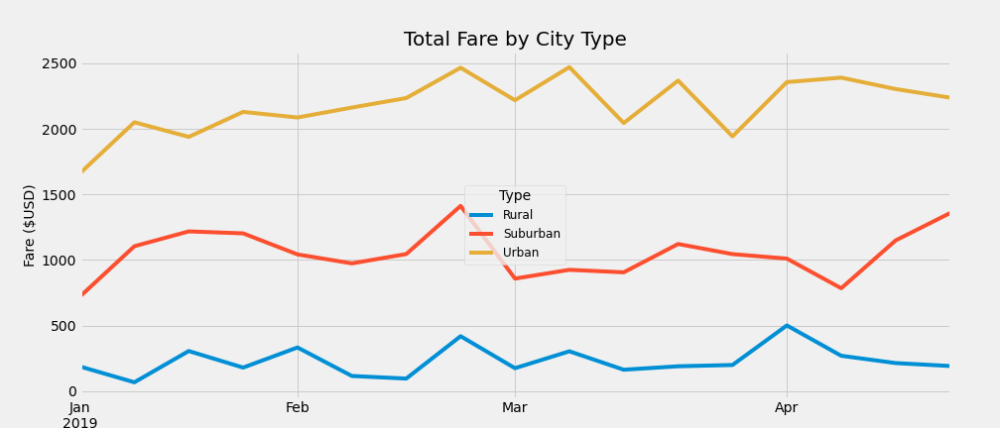

# **PyBer - The Ride sharing data Analysis**
- Analyse the Rideshare data for PyBer using Python, Pandas and use Matplotlib to create graph representing the data analysed.
---
## Overview of the Project :
- PyBer is a ride share business run in Urban, Suburban, Rural type of cities. The ride share data corresponding to these 3 different regions were gathered so that the data is analysed to understand the needs of different regions. 
- Comparing the data of the 3 regions will help to uncover the usage trends vs the available resources, the regions that need extra resources to be deployed, the relationship of the fares with respect to the usage, regions which can improve the business even more. 
- As the analysis needs few calculations that need to be performed, along with Pandas we need to use Numpy and Scipy libraries.
- The jupyter notebook script file can be opened using this link : <a href="https://github.com/VinuthaBS/PyBer_Analysis/blob/main/PyBer_Challenge.ipynb">------> PyBer_Challenge script file</a>
## **PyBer analysis Results**
- The data was analysed to understand the total rides, total drivers, total fares for each type of city.
- Based on the above stats the values for Average Fare per Ride and Average Fare per driver were calculated. 
- From the stats we can easily make out that Rural region has only 2.6% of the drivers and Suburban region with 16.5% of the drivers rest of 80% of drivers are all in Urban areas.
- But in contrast if we see the %composition of total rides and total fares rural almost has a share close to 6%, suburban almost 28% and Urban has close to 65%. This clearly indicates that the Urban region is deployed with 80% of the resources for usage / fare share of 65%. 
- Above gap is impacting on the Average fare per ride as well, with rural having 10$ more than urban and suburban having almost 6$ more than urban average fare per ride.
- At the same time looking at the Average fare per Driver stats indicates that the rural drivers are having 3.3 times of the avg fare per urban driver and suburban drivers have almost 2.5 times the avg fare per urban driver. This indicates that rural drivers and suburban drivers might be working overly when compared to urban drivers (distributed among large team of 80%).
---
- </img>
---
- Plotting the graph of weekly total fare by city type, reveals the same gap in the fare data between the 3 regions with the high fare in urban region and low fare in rural region.
- Overall the line graph, week on week, for each city type remains straight with very less variation around its center and runs almost parallel to the other regions.
- This also indicates that there is no specific timeline between January and April, where the weekly total fare shoots up to a very high peak that the region would require extra resources.
---
- </img>
---
## **Summary**
- Based on the ride share data analyis and results we can infer that there is a need to balance the resources - drivers among the 3 regions based on the business demand/usage seen through - Rides usage / fare data. 
- Instead of having 80% of the drivers in Urban areas, drivers should be moved to suburban and rural areas so that the demands of the 2 regions are also met. 
- The above action should be monitored so that proportionately the average fare per ride is brought down in rural and suburban areas closer to the fare in urban area. This will encourage the customers of rural and suburban areas to Ride share which in turn can increase the business in these regions also.
- Bringing down the Urban drivers by atleast 10% should again be monitored so that the average fare per driver doesnot drop drastically but is maintained by adjusting the avg fare price slightly in Urban areas. That way neither drivers nor customers are affected much.
- With all these changes the weekly total fare by city type also should be monitored to grasp the effects of the above changes week on week. Based on the trends indicated by the graph, suitable actions should be taken in the best interest of the business.
---
--- 